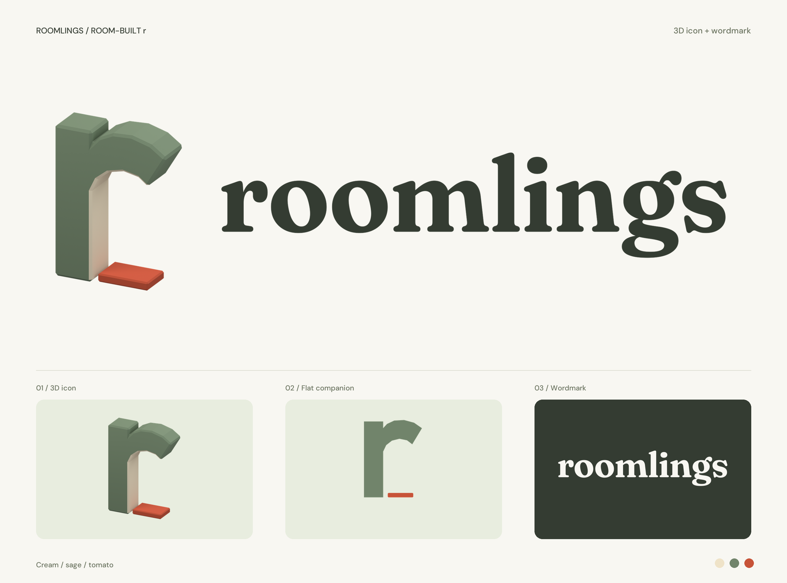
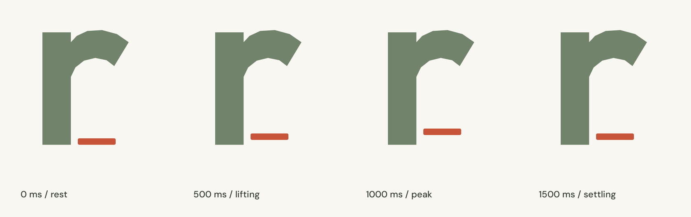

# Roomlings branding

The room-built r represents a shared home, not a specific room. Use the supplied
artwork rather than redrawing the mark or replacing the wordmark with ordinary text.

## App components

`src/Branding.tsx` owns the shared components and imports the small production asset
set from `src/assets/brand`.

| Component | Use |
|---|---|
| `Brand` | Compact flat icon with the outlined SVG wordmark |
| `Brand variant="featured"` | Rendered 3D icon with the SVG wordmark in the landing header; switches to the flat icon on narrow screens |
| `Brand decorative` | Artwork inside a link that already has its own accessible name |
| `LoadingIcon` | Decorative 2D loading mark within an existing loading status or control |
| `LoadingIcon tone="light"` | The light monochrome mark on filled primary buttons |
| `LoadingIcon reducedMotion` | Static mark when a local motion control or paused view requires it |
| `SceneLoading` | Shared, eagerly imported Suspense fallback with the existing status text |

Keep logo link destinations and accessible names. Reserve image dimensions and
preserve the artwork's aspect ratio and clear space. Do not add a WebGL renderer
for branding; the featured icon is a PNG, and the wordmark remains a crisp SVG.
The favicon is the same flat r.

## 2D loader

The r stays still. Only the threshold lifts and settles. The SVG performs the
animation without JavaScript timers or a 3D scene.

| Property | Value |
|---|---|
| Duration | 2 seconds |
| Threshold position | 0, -8, 0 SVG units at 0%, 50%, 100% |
| ViewBox | 128 by 128 |
| Easing per half | `cubic-bezier(.37, 0, .63, 1)` |
| Reduced motion | Static threshold at rest |

The full-color and light SVGs both handle `prefers-reduced-motion` internally.
The landing tour also passes its own motion and pause state to `LoadingIcon`.
Do not apply `.spin`, rotate the full mark, add shadows or turn this into a
progress meter.

Render the loader only while the existing operation is pending. Remove it when
the operation finishes or fails, without waiting for the animation loop to finish.
Keep existing errors, retries, disabled controls and loading messages. Announce
the message in the existing status element; the artwork itself is decorative.

## Source designs

The editable [Blender logo](../design/roomlings-logo/roomlings-logo.blend), generation
scripts and [design handoff](../design/roomlings-logo/DESIGN-HANDOFF.md) live under
`design/roomlings-logo`. The Blender file has a packed, licensed Fraunces font and
relative paths so it does not depend on an external design workspace.

The wordmark is Fraunces 650, optical size 48, softness 45, wonk 1, with adjusted
spacing. Font licenses accompany the design sources. Generated presentation files
and intermediate frames stay out of Git; the runtime assets and approved reference
images above are retained. No Blender or Python dependency is needed by the app.
